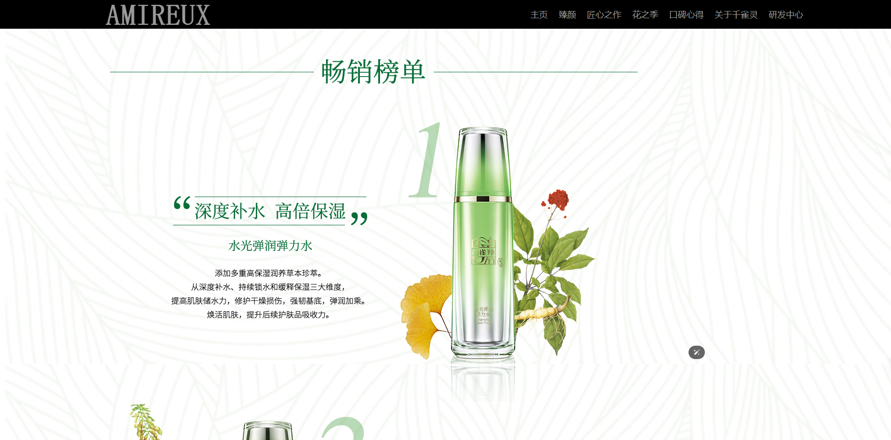

# amireux
<p> 
  <a href="https://nodejs.org/">  </a>
  <a href="https://v2.vuejs.org/">  </a>  
  <a href="https://element.eleme.io/">  </a>
</p> 

化妆品公司主页web网页前端设计，基于node.js+vue+element-ui实现

### 依赖
```
"axios": "0.21.1",
"element-ui": "2.15.2",
"pubsub-js": "1.9.3",
"vue": "2.5.2",
"vue-router": "3.0.1"
```

### 运行
> npm install // 安装依赖

> npm run dev // 启动


## 页面展示

### 主页


### 臻颜


### 匠心之作


### 花之季


### 研发中心


参考：
雅诗兰黛官网：https://www.esteelauder.com.cn/
百雀羚官网：https://www.pechoin.com/
...